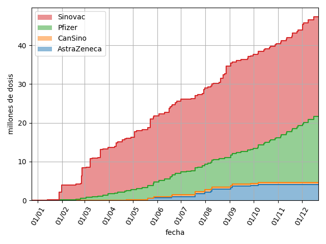
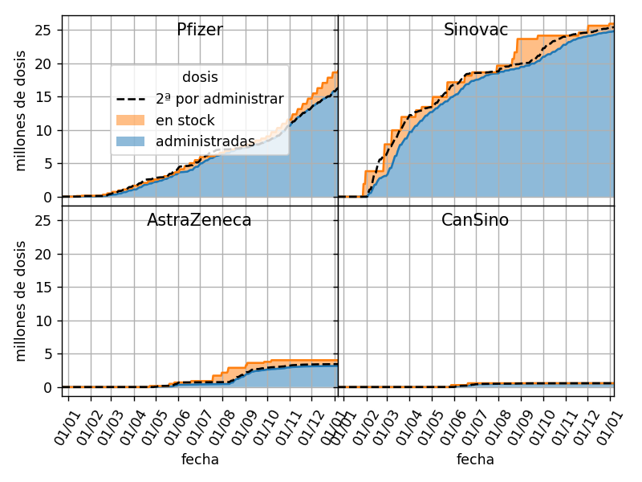
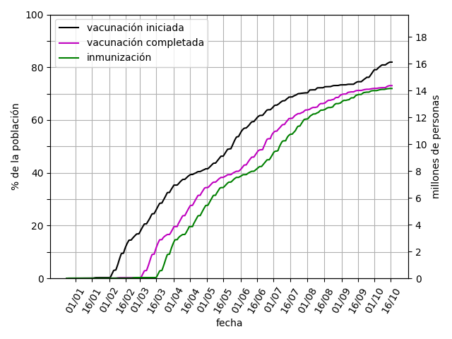
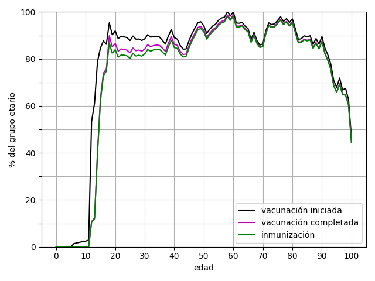

# Avance de la campaña de vacunación Covid-19 en Chile

[Avance de la campaña de vacunación](/output/contrib) 

* [número de vacunas importadas](output/contrib/vacunas_importadas_fabricante_fecha.csv) por fecha de llegada del cargamento y laboratorio. Columnas: `fecha`, `laboratorio`, `cantidad` de dosis, `total_laboratorio_reportado` (número de dosis del laboratorio importadas a la fecha según declaraciones de las autoridades y prensa, sirve de verificación pero no debería ser usado), `total_reportado` (número de vacunas importadas a la fecha según declaraciones de la autoridades y la prensa, sirve de verificación pero no debería ser usado) y `fuente` de la información.  

* [stock de vacunas](output/contrib/stock_de_vacunas_fabricante_fecha.csv) por fecha y fabricante.  Columnas: `fecha`, `laboratorio`, `dosis_administradas`, `segundas_dosis_por_administrar`, `vacunas_importadas`, `vacunas_en_stock`.  Las segundas dosis por administrar de cada fabricante son aproximadas debida al mix and match realizado con AstraZeneca.

* [número de vacunados](output/contrib/total_vacunados_fecha.csv) desde el inicio de la campaña de vacunación hasta la última fecha reportada. Columnas: `fecha`, `primera dosis`, `segunda dosis`, `unica dosis`, `vacunación iniciada` (1a dosis o dosis única), `vacunación terminada` (2a dosis o dosis única) e `inmunización` (segunda dosis + 14 días o dosis única + 14 días).
* [fracción de la población total vacunada](output/contrib/fraccion_vacunados_fecha.csv) desde el inicio de la campaña de vacunación hasta la última fecha reportada. Columnas: `fecha`, `primera dosis`, `segunda dosis`, `unica dosis`, `vacunación iniciada` (1a dosis o dosis única), `vacunación terminada` (2a dosis o dosis única) e `inmunización` (segunda dosis + 14 días o dosis única + 14 días). 

* [número de vacunados en cada grupo etario](output/contrib/total_vacunados_edad.csv) a la última fecha reportada. Columnas: `edad`, `primera dosis`, `segunda dosis`, `unica dosis`, `vacunación iniciada` (1a dosis o dosis única), `vacunación terminada` (2a dosis o dosis única) e `inmunización` (segunda dosis + 14 días o dosis única + 14 días). 
* [fracción de vacunados en cada grupo etario](output/contrib/fraccion_vacunados_edad.csv) a la última fecha reportada. Columnas: `edad`, `primera dosis`, `segunda dosis`, `unica dosis`, `vacunación iniciada` (1a dosis o dosis única), `vacunación terminada` (2a dosis o dosis única) e `inmunización` (segunda dosis + 14 días o dosis única + 14 días). 

Fuentes: 
* Datos de la campaña de vacunación del DEIS publicados por el MinCiencias.
* Proyección de población INE al 30 de junio de 2021.
* Comunicados del Ministerio de Salud

